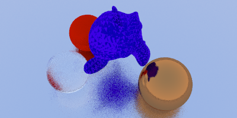

# go3d




A Ray tracer in go
It support differents materials and geometries

Materials :

- Lambertians
- Metals
- Dielectrics

Geometry:

- spheres
- triangles

~~I might add .obj imports someday~~
It's kind of working

Based on Raytracing In One Weekend by Peter Shirley

# building and runing

```
cd cmd/3dgo
go build
./3dgo
```

It outputs ppm files,

If you want to change the scene,
scene description and rendering parameters are in the main function of main.go
